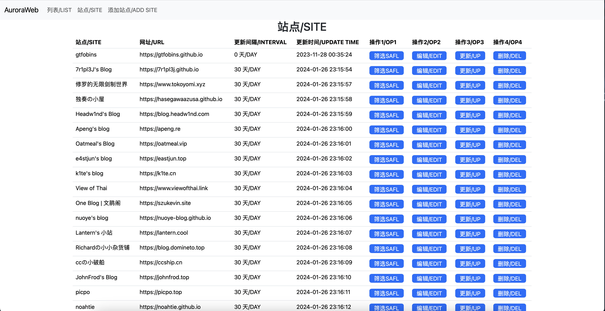
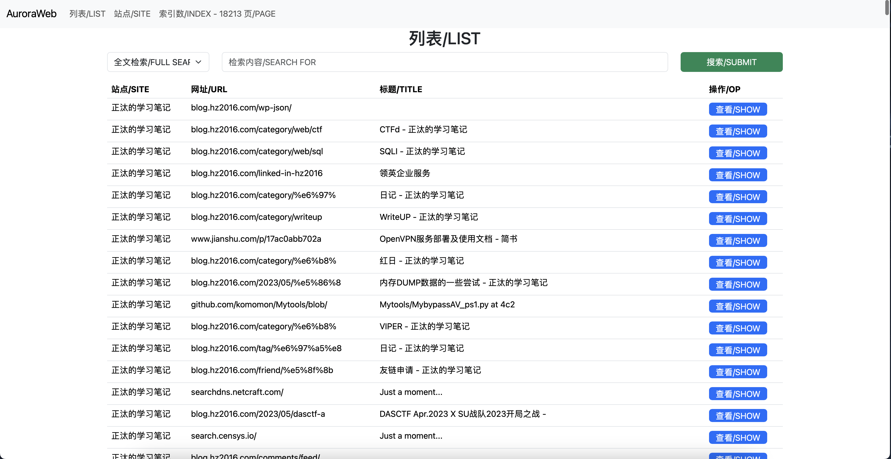
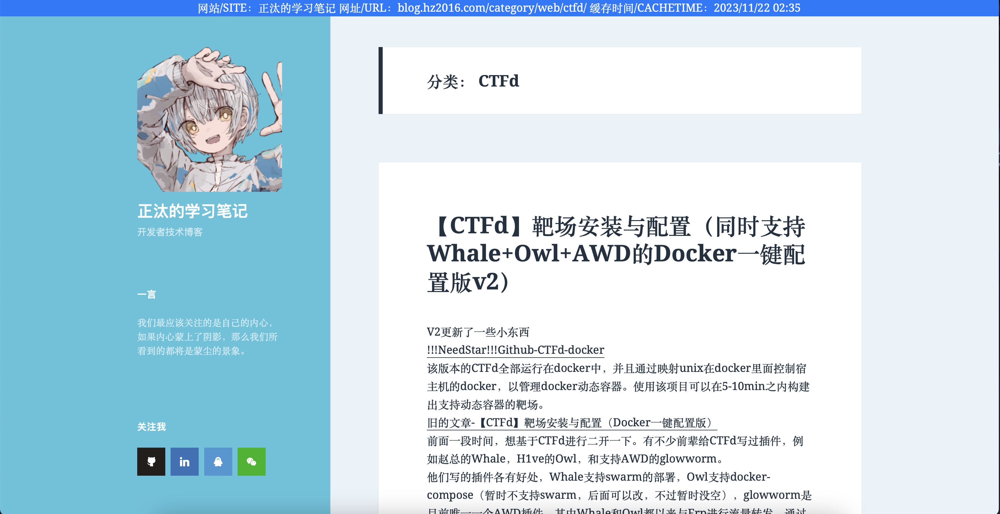

# AuroraWebSpider
为在离线环境下部份无趣的CTF比赛提供相应的数(现)据(学)支(现)持(卖)
1. 定时循环抓取博客链接及外链
2. 缓存为离线html文件
3. 提供相应的检索功能

TODO：
1. 抓取对应的git文件
2. 缓存部份附件/PDF
3. 删除无效网页/缓存

**本项目仅供学习参考，请勿将服务公开，并且在授权后进行相关操作**
在项目测试中，使用了部份师傅的博客进行测试，感谢他们的支持。

## 效果如图
### 站点界面

### 筛选/搜索界面

### 缓存界面

### Web Server
可视化前端
'''shell
python app.py
'''

### Spider Server
此服务用于递归爬去网站内容
'''shell
python spider.py
'''

### Singlefile Server
此服务用于静态页面抓取
'''shell
npm install -g "single-file-cli"
python Singlefile.py
'''
